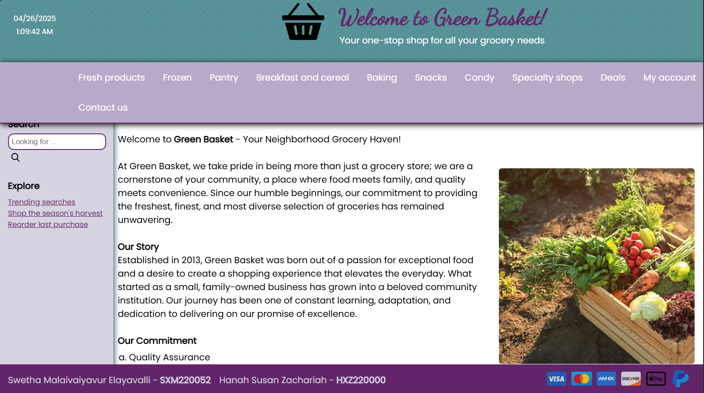
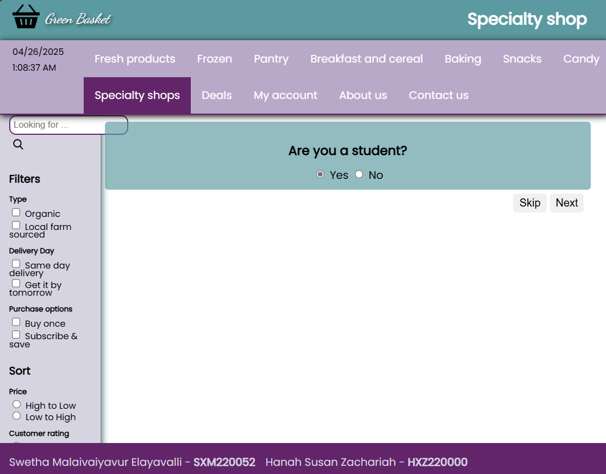
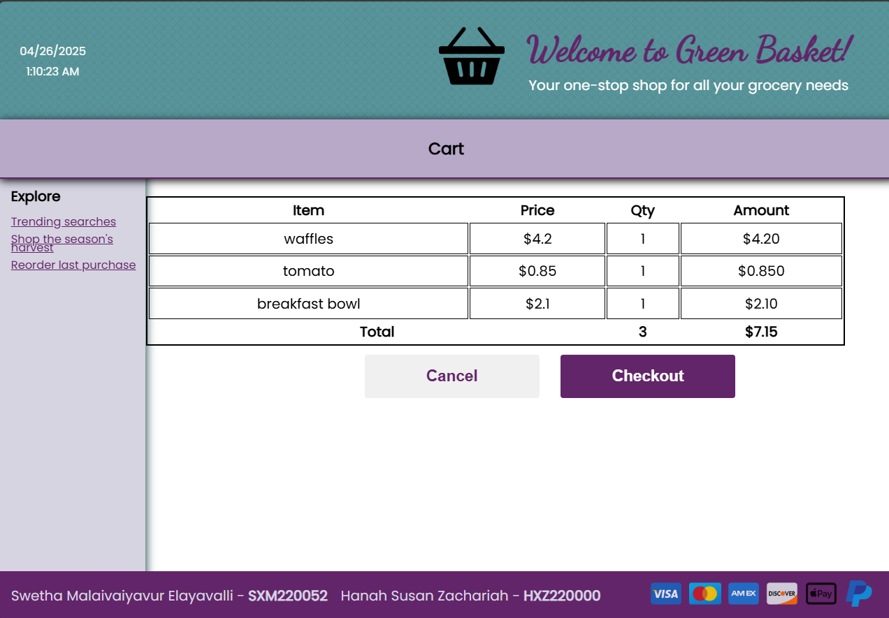

# 🧺 Green Basket Web Application 🛒

A web-based shopping application for a grocery store that demonstrates fundamental web development concepts using PHP, HTML, CSS, and JavaScript, MySQL.

## 🛠️ Tech Stack

- Frontend: HTML5, CSS3, JavaScript (with jQuery) 💻
- Backend: PHP 🐘
- Database: MySQL 🐬
- Server: WAMP (Windows, Apache, MySQL, PHP) 🌐
- Styling: Bootstrap 3 ✨
- Fonts & Icons: Google Fonts ✒️, Custom Icons 🖼️
- XML Inventory Management 📄

---

## 📋 Screenshots of the Application

---
## ✨ Features

1. User Authentication: 🔑
   - Login System 🚪
   - Registration Form 📝
   - User Session Management 👤

2. Product Management: 📦
   - Multiple product categories (Fresh 🍎, Frozen 🧊, Snacks 🥨, etc.)
   - XML-based inventory system 📜
   - Product search functionality 🔍

3. Shopping Cart: 🛒
   - Add/remove products <0xF0><0x9F><0x9B><0x92>➕<0xF0><0x9F><0x9B><0x92>➖
   - Cart total calculation 🔢
   - Persistent cart storage 💾

4. User Interface: 🎨
   - Responsive navigation bar 📱
   - Product category pages 📂
   - Search and filter options 🔎
   - Shopping cart integration 🛒🔗
   - Responsive design elements 📐

5. Administrative Features: ⚙️
   - User management 🧑‍💼
   - Inventory control <0xF0><0x9F><0x97><0x82>️
   - Discount systems 🏷️

## 🖼️ User Interface

The application features a clean, user-friendly interface with:
- A consistent navigation bar ⬆️
- Category-specific product listings 📂🍎🧊🥨
- Search and filter options 🔍
- Shopping cart integration 🛒🔗
- Responsive design elements 📱💻

## 📚 Educational Value

This project was crucial for understanding:
1. Fundamental web development concepts 💡
2. PHP programming basics 🐘
3. MySQL database operations 🐬
4. Session management 👤
5. XML data handling 📄
6. Object-oriented programming concepts <0xF0><0x9F><0xA7><0xAE>
7. MVC (Model-View-Controller) pattern basics 🏛️
8. Frontend development with HTML/CSS/JavaScript 💻🎨
9. Database design and normalization ⚙️
10. User authentication and authorization 🔑🛡️

## 🚀 How to Run the Project

### ✅ Prerequisites
- WAMP Server installed on your machine 🌐
- PHP 7.x or higher 🐘
- MySQL 5.x or higher 🐬

### ⚙️ Steps to Run:

1. Install WAMP Server: 💾
   - Download and install WAMP Server from [WAMP Server Official Website](http://www.wampserver.com/en/) 🔗
   - Follow the installation instructions 📄

2. Configure WAMP: 🛠️
   - Ensure Apache, MySQL, and PHP services are running ✅
   - Set up PHPMyAdmin through the WAMP control panel ⚙️

3. Project Setup: 📂
   - Create a new database in PHPMyAdmin 🐬➕
   - Import the database schema (if provided) 📄➡️🐬
   - Place the project files in the WAMP `www` directory 📂➡️🌐

4. Run the Application: ▶️
   - Start WAMP Server 🟢
   - Open your web browser 🌐
   - Navigate to `http://localhost/your_project_folder/` ➡️

### ⚠️ Important Notes:
- Ensure all file permissions are correctly set 🔓
- Verify database connection settings ⚙️🔗
- Test all features thoroughly ✅
- Regularly backup your database 💾🛡️